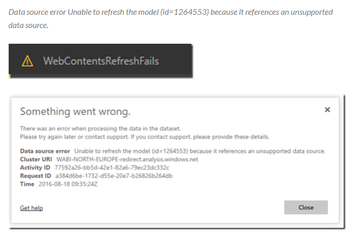

# Auvik Power BI Dashboard - Refresh Schedule Fix

## The Problem

If you want to upload your dashboard to the web version of Power BI, you have run into the following error:

](data-refresh.png)

This is because of the way the queries are structured in the editor. The calls made to the Auvik API are considered "dynamic" because their query string has variables that aren't static at runtime.

To solve this issue, we need to trick Power BI into *thinking* that the data sources are static, while still making sure they are dynamic enough to use the report parameters to get the correct data.

Here is an example of the query before its refactored (dynamic).

```F#
getOnePage =
    (url) as record =>
    let
      parsedResults = Json.Document(Web.Contents(url)),
      pageData = try parsedResults[data] otherwise null,
      next = try parsedResults[links][next] otherwise null,
      ret = [retData=pageData, retNext=next]
    in
      ret,
```

Here is the query after we trick it into thinking it's static:

```F#
baseUrl = "https://auvikapi." & #"Auvik Server Cluster" & ".my.auvik.com/v1/",
    getOnePage = (Path) as record =>
        let
            parsedResults = Json.Document(Web.Contents(baseUrl, [
                RelativePath = Path
            ])),
            parsedData = try @parsedResults[data] otherwise null,
            next = try Text.Replace(@parsedResults[links][next], baseUrl, "") otherwise null,
            ret = [retData = @parsedData, retNext = @next]
        in
            ret,
```

Huge credit goes to Chris Webb's blog, where he goes into more detail on the `Web.Contents()` function and why this happens. Here are a couple of links that I used as inspiration for this fix.

<https://blog.crossjoin.co.uk/2014/03/26/working-with-web-services-in-power-query/>
<https://blog.crossjoin.co.uk/2016/08/23/web-contents-m-functions-and-dataset-refresh-errors-in-power-bi/>

## The Solution

*Note:* *I am making these changes in Power BI desktop using the `.pbix` template provided by Auvik's github*

After uploading the provided Auvik template and entering your credentials, follow these steps:

1. Make sure you are on the `Home` tab
2. Select `Transform Data` 
3. You should now see a list of all the data sources on the left sidebar. Click on the source `Sites`. Then select `Advanced Editor` on your toolbar. 
4. You will be presented with something that looks like this. 
5. Find the folder corresponding to the source you are working on (i.e. Sites), and select the `new.pq` file. 
6. Copy all of the contents and paste them back into your advanced editor screen on Power BI. It should look something like this - .
7. Hit the green `Done` button in the bottom right corner, and verify that your data was refreshed correctly.
8. Repeat these steps for each source **EXCEPT THE FOLLOWING**:
    - `TIME`
    - `DATE`
    - `DOMAIN PREFIX OF MAIN SITE`
    - `REPORT START DATE`
    - `REPORT END DATE`
    - `AUVIK SERVER CLUSTER`

## Questions

Please reach out to me at `jack.stubblefield.dev@gmail.com` with any quesitons

## License

[MIT](https://choosealicense.com/licenses/mit/)